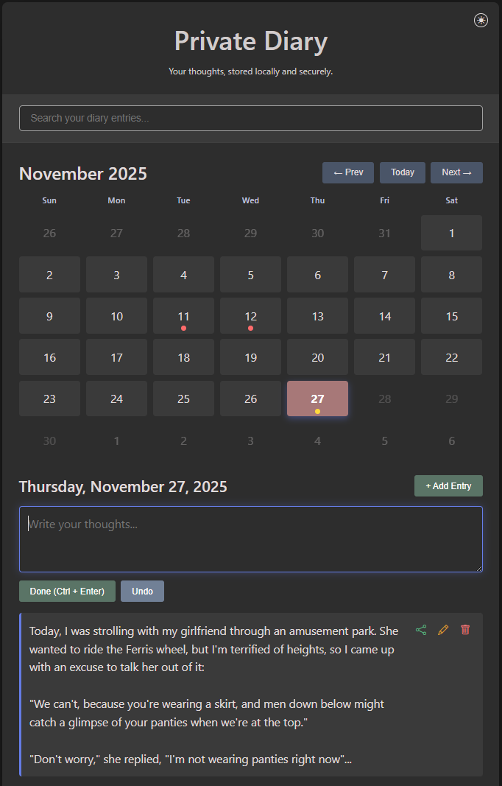

# Private Diary Cloud 📖☁️

A cloud-based Progressive Web App (PWA) for sharing diary entries with the world. Built with Supabase for authentication and data storage.



## 🌟 Features

### 🔐 Authentication
- **User Registration**: Sign up with email and password
- **Secure Login**: Authentication powered by Supabase Auth
- **Session Management**: Automatic session handling and persistence

### 📖 Public Diary Entries
- **Read All Entries**: Anyone can view all diary entries from all users
- **Write Your Own**: Only registered users can create, edit, and delete their own entries
- **Rich Content**: Support for text entries with image attachments
- **Real-time Updates**: Entries are instantly available to all users

### 🎨 Modern Interface
- **Responsive Design**: Works perfectly on mobile, tablet, and desktop
- **Dark/Light Themes**: Toggle between themes with system preference detection
- **Multi-language Support**: Available in English, French, German, and Russian
- **Intuitive Calendar**: Visual calendar interface with entry indicators

### 📱 Progressive Web App
- **Installable**: Add to home screen on mobile and desktop
- **Offline Ready**: Service worker enables offline functionality
- **Native Feel**: Fullscreen experience when installed

## 🚀 Getting Started

### Prerequisites
- Supabase account and project
- Web server (for development: Python, Node.js, or any static server)

### Setup Instructions

1. **Clone the repository**
   ```bash
   git clone <repository-url>
   cd private-diary-cloud
   ```

2. **Configure Supabase**
   - Create a new Supabase project at [supabase.com](https://supabase.com)
   - Update `config.js` with your Supabase URL and anon key:
     ```javascript
     const SUPABASE_URL = 'your-supabase-url';
     const SUPABASE_ANON_KEY = 'your-supabase-anon-key';
     ```

3. **Set up the database**
   Run this SQL in your Supabase SQL editor:
   ```sql
   -- Create diary_entries table
   CREATE TABLE diary_entries (
       id UUID DEFAULT gen_random_uuid() PRIMARY KEY,
       user_id UUID REFERENCES auth.users(id) ON DELETE CASCADE,
       date DATE NOT NULL,
       text TEXT,
       images JSONB DEFAULT '[]'::jsonb,
       created_at TIMESTAMP WITH TIME ZONE DEFAULT NOW(),
       updated_at TIMESTAMP WITH TIME ZONE DEFAULT NOW()
   );

   -- Enable RLS (Row Level Security)
   ALTER TABLE diary_entries ENABLE ROW LEVEL SECURITY;

   -- Policy: Users can only modify their own entries
   CREATE POLICY "Users can only modify their own entries" ON diary_entries
       FOR ALL USING (auth.uid() = user_id);

   -- Policy: Everyone can read all entries
   CREATE POLICY "Everyone can read all entries" ON diary_entries
       FOR SELECT USING (true);

   -- Indexes for performance
   CREATE INDEX idx_diary_entries_user_date ON diary_entries(user_id, date);
   CREATE INDEX idx_diary_entries_text_search ON diary_entries USING gin(to_tsvector('english', text));

   -- Storage bucket for images
   INSERT INTO storage.buckets (id, name, public) VALUES ('diary-images', 'diary-images', true);

   -- Storage policies
   CREATE POLICY "Users can upload their own images" ON storage.objects
       FOR INSERT WITH CHECK (bucket_id = 'diary-images' AND auth.uid()::text = (storage.foldername(name))[1]);

   CREATE POLICY "Everyone can view images" ON storage.objects
       FOR SELECT USING (bucket_id = 'diary-images');

   CREATE POLICY "Users can delete their own images" ON storage.objects
       FOR DELETE USING (bucket_id = 'diary-images' AND auth.uid()::text = (storage.foldername(name))[1]);
   ```

4. **Serve the application**
   ```bash
   # Using Python
   python -m http.server 8000
   
   # Using Node.js
   npx serve
   
   # Using PHP
   php -S localhost:8000
   ```

5. **Access the app**
   Open your browser and navigate to `http://localhost:8000`

## 🏗️ Architecture

### Frontend
- **Vanilla JavaScript**: No frameworks, pure ES6+ JavaScript
- **CSS3**: Modern CSS with custom properties and responsive design
- **HTML5**: Semantic markup with accessibility in mind

### Backend (Supabase)
- **Authentication**: Supabase Auth for user management
- **Database**: PostgreSQL with Row Level Security
- **Storage**: Supabase Storage for image uploads
- **Real-time**: Built-in real-time capabilities (can be extended)

### File Structure
```
private-diary-cloud/
├── index.html          # Main HTML file
├── styles.css          # All CSS styles
├── app.js             # Main application logic
├── config.js          # Supabase configuration
├── translations.js    # Multi-language support
├── manifest.json      # PWA manifest
├── service-worker.js  # Offline functionality
└── README.md         # This file
```

## 🔒 Security & Privacy

### Data Access
- **Public Reading**: All diary entries are publicly readable
- **Private Writing**: Only authenticated users can create/edit/delete their own entries
- **Secure Authentication**: Powered by Supabase Auth with industry-standard security

### Row Level Security
- Database policies ensure users can only modify their own content
- Images are organized by user ID in storage buckets
- All data access is controlled at the database level

## 🌍 Deployment

### Netlify
1. Connect your GitHub repository to Netlify
2. Set build command: (none needed)
3. Set publish directory: `/`
4. Deploy

### Vercel
1. Import your GitHub repository
2. No build configuration needed
3. Deploy

### GitHub Pages
1. Push to GitHub repository
2. Enable GitHub Pages in repository settings
3. Select source branch
4. Access via `https://username.github.io/repository-name`

## 🛠️ Development

### Local Development
```bash
# Start local server
python -m http.server 8000

# Open in browser
open http://localhost:8000
```

### Testing
- Test authentication flows
- Verify CRUD operations for entries
- Test image upload and display
- Verify responsive design on different devices
- Test PWA installation

## 📝 API Reference

### Supabase Tables

#### diary_entries
- `id`: UUID (Primary Key)
- `user_id`: UUID (Foreign Key to auth.users)
- `date`: DATE
- `text`: TEXT
- `images`: JSONB (Array of image URLs)
- `created_at`: TIMESTAMP
- `updated_at`: TIMESTAMP

#### Storage Buckets
- `diary-images`: Public bucket for image storage

## 🤝 Contributing

1. Fork the repository
2. Create a feature branch
3. Make your changes
4. Test thoroughly
5. Submit a pull request

## 📄 License

This project is released under the MIT License.

## 🆘 Support

For issues and questions:
1. Check the GitHub Issues page
2. Create a new issue with detailed description
3. Include browser and device information

---

*Share your thoughts with the world* ✨